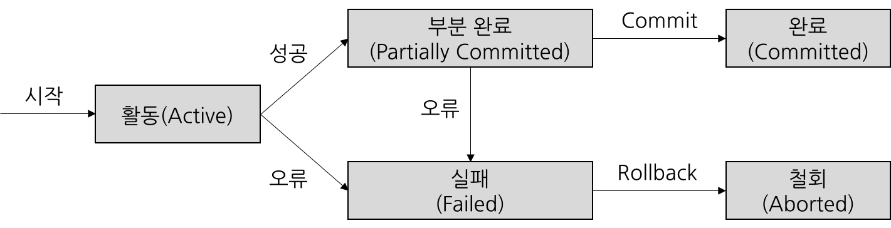

# Database

### 데이터베이스 설계

- 요구조건 분석 → 설계(개념적 설계 → 논리적 설계 → 물리적 설계) → 구현 → 운영 및 유지보수
- 개념적 설계
  - 개체-관계 모델(ERM)을 통하여 개체 타입과 이들간의 관계타입을 이용하여 현실 세계를 개념적으로 표현
    - 개체-관계 모델 : 개체, 속성, 관계를 기호를 활용하여 데이터베이스의 전반적인 구조를 간단하게 표현한 모델
  - 산출물은 개체-관계 다이어그램(ERD)
  - 논리적 설계
  - 개념적 설계에서 만들어진 구조를 기반으로 DBMS가 처리할 수 있는 데이터베이스의 논리적 구조를 설계하는 단계
  - 정규화가 진행되는 단계
  - 스키마(Schema) : 데이터베이스의 전체적인 구조와 제약조건에 대한 명세를 기술,정의한 것.
    - 외부 스키마 : 전체 데이터 중에서 사용자가 바라보는 일부분에서의 논리적 구조
    - 개념 스키마 : 논리적 관점(사용자 관점)에서 본 전체적인 데이터의 논리적인 구조
    - 내부 스키마 : 물리적인 저장장치 관점에서 본 데이터베이스의 구조
- 물리적 설계
  - 논리적으로 설계된 데이터베이스 구조를 토대로 하드웨어나 운영체제의 특성을 고려하여 그에 알맞은 인덱스의 구조와 내부 저장 구조 및 접근 경로를 설계하는 단계
  - 저장 레코드의 양식을 설계, 물리적인 데이터의 타입이나 사이즈 등을 정의, 역정규화가 진행되는 단계


### 데이터베이스 풀

- Connection Pool

  - 클라이언트의 요청에 따라 각 어플리케이션의 스레드에서 데이터베이스에 접근하기 위해서는 Connection이 필요하다.
  - Connection pool은 이런 Connection을 여러 개 생성해 두어 저장해 놓은 **공간(캐시)**, 또는 이 공간의 Connection을 필요할 때 꺼내 쓰고 반환하는 **기법**을 말한다.

  

- DB에 접근하는 단계

  1. 웹 컨테이너가 실행되면서 DB와 연결된 Connection 객체들을 미리 생성하여 pool에 저장한다.
  2. DB에 요청 시, pool에서 Connection 객체를 가져와 DB에 접근한다.
  3. 처리가 끝나면 다시 pool에 반환한다.

  

- Connction이 부족하면?

  - 모든 요청이 DB에 접근하고 있고 남은 Conncetion이 없다면, 해당 클라이언트는 대기 상태로 전환시키고 Pool에 Connection이 반환되면 대기 상태에 있는 클라이언트에게 순차적으로 제공된다.

- 왜 사용할까?

  - 매 연결마다 Connection 객체를 생성하고 소멸시키는 비용을 줄일 수 있다.
  - 미리 생성된 Connection 객체를 사용하기 때문에, DB 접근 시간이 단축된다.
  - DB에 접근하는 Connection의 수를 제한하여, 메모리와 DB에 걸리는 부하를 조정할 수 있다.

- Thread Pool

  - 비슷한 맥락으로 Thread pool이라는 개념도 있다.
  - 이 역시 매 요청마다 요청을 처리할 Thread를 만드는것이 아닌, 미리 생성한 pool 내의 Thread를 소멸시키지 않고 재사용하여 효율적으로 자원을 활용하는 기법.

- Thread Pool과 Connection pool

  - WAS에서 Thread pool과 Connection pool내의 Thread와 Connection의 수는 직접적으로 메모리와 관련이 있기 때문에, 많이 사용하면 할 수록 메모리를 많이 점유하게 된다. 그렇다고 반대로 메모리를 위해 적게 지정한다면, 서버에서는 많은 요청을 처리하지 못하고 대기 할 수 밖에 없다.
  - 보통 WAS의 Thread의 수가 Conncetion의 수보다 많은 것이 좋은데, 그 이유는 모든 요청이 DB에 접근하는 작업이 아니기 때문이다.


### 정규화(Normalization)

- 정의
  - 관계형 데이터베이스(RDBMS)의 설계에서 중복을 최소화하게 데이터를 구조화하는 프로세스
  - 정규화 된 정도를 정규형(Normal Form, NF)라 하는데, 정규형은 1NF, 2NF, 3NF, BCNF, 4NF, 5NF, 6NF까지 있다.
  - 정규화의 과정은 삽입, 변경, 삭제 등의 과정에서 발생하는 문제점을 해결하는 방안이 될 수 있다.
  - 비공식적으로 3NF가 되었다면 테이블의 대부분이 삽입, 변경, 삭제 이상이 없으므로 3NF가 되었다면 정규화되었다고 말할 수 있다.
- 제 1정규형(1NF)
  - 최소한의 테이블 관계이며, **중복되는 항목이 없어야** 한다.
  - 다른 말로는 릴레이션에 속한 모든 속성의 도메인의 값들이 원자성(Atomicity, 하나의 컬럼은 하나의 값을 가진다.)를 가지면 **제 1정규형**이다.
- 제 2정규형(2NF)
  - 제 1정규형을 만족하면서 기본키가 아닌 모든 속성이 기본키에 완전 함수 종속되면 **제 2정규형**이다.
  - 속성 간의 부분 함수 종속성을 제거하기 위해서는 릴레이션을 분리할 필요가 있다.
  - 제 2정규형을 만족한다 하더라도 삽입, 갱신, 삭제 이상이 일어날 수 있다. 이는 **이행적 함수 종속**이 존재하기 때문이다.
- 제 3정규형(3NF)
  - 제 1,2정규형을 만족하면서 기본키가 아닌 모든 속성이 기본키에 이행적 함수 종속이 되지 않으면 **제 3정규형**이다.
  - **이행적 함수 종속(Transitive Functional Dependency)**
    - 삼단논법과 비슷한 관계를 갖는 함수 종속
    - X → Y, Y → Z, Z → Y의 관계로 종속되는 경우
  - 제 3정규형을 만족한다 하더라도 이상현상이 발생할 수 있다.
- 보이스-코드 정규형(BCNF, Boyce-Codd Normal Form)
  - 제 3정규형에서 발생하는 이상현상을 해결하기 위한 정규형으로 Strong 3NF라고도 한다.
  - 제 3정규형을 만족하면서 **모든 결정자가 후보키 집합에 속하는 집합형**
  - 이론적으로 다음 조건을 만족시키는 릴레이션은 BCNF라고 한다.
    - X → Y는 부분집합(trivial FD) 이거나, X는 릴레이션 R의 슈퍼키이다.
  - 제 3정규형을 만족하면서 BCNF를 만족하지 않는 경우?
    - **일반 컬럼이 후보키를 결정**하는 경우
- 제 4정규형(4NF)
  - BCNF를 만족하면서 릴레이션에서 다치 종속 관계(Multival Dependency)를 제거한 정규형
  - 다치 종속 : 두 속성이 1:다 대응이 되는 경우
- 제 5정규형(5NF)
  - 후보키를 통하지 않은 조인 종속(Join Dependency)을 제거한 정규형
- 정리
  - 테이블 → (열을 추가하여 원자성을 확보) → 1차 정규화 → (부분적 종속이 생긴 컬럼들을 위한 릴레이션 분리) → 2차 정규화 → (이행적 함수 종속을 없애기 위한 릴레이션 분리) → 3차 정규화


### 역정규화(Denormalization)

- 정의
  - 정규화를 통히 분리되었던 릴레이션에서 중복을 허용하여 다시 통합하거나 분할하여 구조를 재조정하는 과정
  - 정규화된 데이터베이스는 검색 과정에서 외래키를 이용해 참조하게 되는데, 이 과정에서 저장된 자료를 검색하는 시간이 증가하여 성능이 저하될 수 있다.
  - 또한, 과도한 정규화는 많은 Join 작업이 일어나 데이터베이스의 성능을 저하시킨다.
  - 역정규화의 종류에는 릴레이션 역정규화와 속성 역정규화가 있다.
- 릴레이션 역정규화
  - 릴레이션 병합 : 두 릴레이션 간의 참조가 잦다면 두 릴레이션을 하나로 병합
  - 릴레이션 분할 : 자주 사용하는 속성이나 튜플과 자주 사용하지 않는 속성이나 튜플을 구분하여 릴레이션을 분할
- 속성 역정규화
  - 릴레이션의 속성을 향상시키기위해 속성 또는 파생속성을 추가


### 트랜잭션

- 데이터베이스를 변화시키는데 수행되는 작업의 논리적 단위

- 트랜잭션의 성질(ACID)
  - 원자성(Atomicity) : 트랜잭션의 연산은 데이터베이스에 모두 반영 되거나 반영되지 않아야 한다. 트랜잭션 수행 과정에서 오류가 발생했을 경우, 모든 트랜잭션이 취소된다.
  - 일관성(Consistency) : 트랜잭션이 성공적으로 수행되었다면 데이터베이스의 상태는 이전과 동일해야한다. 즉, 데이터베이스 시스템이 가지고 있는 고정 요소는 트랜잭션 전, 후에도 같아야 한다.
  - 독립성, 격리성(Isolation) : 둘 이상의 트랜잭션이 동시에 실행되는 경우, 하나의 트랜잭션이 다른 하나의 트랜잭션의 수행 과정에 영향을 끼치지 않는다. 수행중인 트랜잭션이 완전히 완료될 때까지 다른 트랜잭션에서 수행 결과를 참조할 수 없다.
  - 영속성, 지속성(Durability) : 성공적으로 완료된 트랜잭션의 결과는 데이터베이스 시스템이 고장나더라도 영구적으로 반영되어야 한다.
  
- 트랜잭션 연산
  - Commit : 한 개의 논리적 단위(트랜잭션)에 대한 작업이 성공적으로 끝났고, 데이터베이스가 일관성을 만족할 때 시스템에 트랜잭션이 완료되었음을 알리는 연산작업
  - Rollback : 한 개의 트랜잭션 처리가 비정상적으로 종료되어 데이터베이스의 일관성을 만족하지 못했을 때, 트랜잭션의 일부가 정상적으로 처리되었다 하더라도 원자성에 따라 이루어진 트랜잭션의 일부를 모두 취소하는 연산작업
  
- 트랜잭션 상태

  - 활동(Active)
    - 트랜잭션이 실행 중에 있는 상태, 연산들이 정상적으로 실행 중인 상태
  - 장애(Failed)
    - 트랜잭션이 실행에 오류가 발생하여 중단된 상태
  - 철회(Aborted)
    - 트랜잭션이 비정상적으로 종료되어 Rollback 연산을 수행한 상태
  - 부분 완료(Partially Committed)
    - 트랜잭션이 마지막 연산까지 실행했지만, Commit 연산이 실행되기 직전의 상태
  - 완료(Committed)
    - 트랜잭션이 성공적으로 종료되어 Commit 연산을 실행한 후의 상태

  

- 트랜잭션의 격리성
  
  - 일관성과 마찬가지로 Lock을 강하고 오래 유지할수록 강화되고, Lock을 최소화할수록 약화된다.
  
- DB index 개념, 언제사용하는지
  
  - 특정 데이터의 위치를 알려주는 주소 정보
  - DB index 사용과정
    - 데이터 조회 요청 시에 DB 서버는 DB 버퍼 캐시(Memory)를 먼저 확인한다.
      - 메모리에는 자주 사용되는 테이블이 캐싱되어 있다.
    - 메모리에 데이터가 있다면 해당 데이터를 참고하여 빠르게 조회 작업을 수행한다.
    - 메모리에 데이터가 없다면 모든 테이블을 조회한다.(Table Full Scan)
    - 모든 테이블을 조회하는 것은 많은 자원을 소모하므로 이러한 문제점을 해결하기 위해 index가 필요하다.
  
- DB 정렬에는 어떠한 정렬이 사용되는가

  - 내부정렬 : 소량의 데이터를 주기억장치에 보관하여 정렬하는 방식
    - 힙 정렬, 삽입 정렬, 버블 정렬, 셀 정렬, 선택 정렬, 퀵 정렬, 2-way Merge 정렬, 기수 정렬(Radix Sort)
  - 외부정렬 : 대량의 데이터를 보조기억장치에 보관하여 정렬하는 방식
    - 밸런스 병합 정렬, 캐스케이드 병합 정렬, 폴리파즈 병합 정렬, 오실레이팅 병합 정렬
  - 정렬 알고리즘 선택 시 고려사항
    - 초기 데이터의 배열 상태
    - 키 값들의 분포 상태
    - 소요공간 및 작업시간
    - 사용 컴퓨터 시스템의 특성
    - 데이터의 양


### N+1 Problem

- 정의

  - 1 대 다(one-to-many), 또는 다 대 다(many-to-many) 관계의 데이터를 불러올 때 발생
  - 대부분의 ORM은 Lazy-Loading 방식인데, N개의 데이터를 불러올 때 각각을 하나의 쿼리로 가져옴
    - N개의 쿼리 + 1개의 쿼리(원래 작성했던 쿼리) = N+1
    - N의 값이 커질수록 DB에 걸리는 부하가 많아진다.

  ```ruby
  @recent_articles = Article.order(published_at: :desc).limit(5)
  
  #in our view file
  @recent_articles.each do |article|
      Title: <%= article.title %> 
      Author:<%= article.author.name %>
  end
  ```

  ```SQL
  Article Load (0.9ms) SELECT 'articles'.* FROM 'articles'
  Author Load (0.4ms) SELECT 'authors'.* FROM 'authors' WHERE 'authors'.'id' = ? ORDER BY 'authors'.'id' ASC LIMIT 1 [["id", 1]]
  Author Load (0.3ms) SELECT 'authors'.* FROM 'authors' WHERE 'authors'.'id' = ? ORDER BY 'authors'.'id' ASC LIMIT 1 [["id", 2]]
  Author Load (0.4ms) SELECT 'authors'.* FROM 'authors' WHERE 'authors'.'id' = ? ORDER BY 'authors'.'id' ASC LIMIT 1 [["id", 3]]
  Author Load (0.3ms) SELECT 'authors'.* FROM 'authors' WHERE 'authors'.'id' = ? ORDER BY 'authors'.'id' ASC LIMIT 1 [["id", 4]]    
  Author Load (0.4ms) SELECT 'authors'.* FROM 'authors' WHERE 'authors'.'id' = ? ORDER BY 'authors'.'id' ASC LIMIT 1 [["id", 5]]
  ```

- 해결법 : Eager Loading

  - `Model.find`에 의해 가능한한 적은 쿼리를 사용하여 반환된 객체들을 불러오는 매커니즘

  ```ruby
  #Using includes(:authors) will include authors model.
  @recent_articles = Article.order(published_at: :desc).includes(:authors).limit(5)
  
  #in our view file
  @recent_articles.each do |article|
      Title: <%= article.title %> 
      Author:<%= article.author.name %>
  end
  ```

  ```sql
  Article Load (0.4ms) SELECT 'articles'.* FROM 'articles'
  Author Load (0.4ms) SELECT 'authors'.* FROM 'authors' WHERE 'authors'.'id' IN (1,2,3,4,5)
  ```

- Django에서는 `select_related`, `prefetch_related`가 존재


### SQL DB vs NoSQL DB

#### SQL DB

- 특징
  - Schema : 스키마를 통해 테이블의 구조가 정의되야아 함
  - Relation : 테이블 간에 관계(Join)를 통해 데이터를 파악, 데이터의 정합성
  - 수직적 확장(Scale-Up) : CPU나 RAM 및 하드웨어 업데이트를 통해 서버의 성능을 향상
  - ACID(Atomicity, Consistency, Isolation, Durability) 이론을 따름.

#### NoSQL DB

- 특징
  - No Schema : 스키마를 통해 구조가 정의되지 않음. JSON,객체와 비슷한 Key-Value pair 형태의 데이터가 Document에 저장되고, Document들이 모여 Collection을 이룬다. (Document - Collection - Database)
  - Non-relation : 관계(Join)이 존재하지 않아 정규화 처리가 없다. 따라서, 중복된 데이터가 존재할 수 있다.
  - 수평적 향상(Scale-Out) : 서버를 추가하여 데이터를 분산 시킬 수 있음.
  - CAP(Consistency, Availability, Partitions Tolerance)이론을 따름.
    - 일관성(Consistency) : 트랜잭션이 성공적으로 수행되었다면 데이터베이스의 상태는 이전과 이후가 같아야한다.
    - 가용성(Availability) : 모든 요청은 정상 응답을 받아야하며, 몇몇 노드에서 장애가 발생하더라도 시스템은 작동해야한다.
    - 분리 내구성(Partitions Tolerance) : DB간 통신이 실패하는 경우에라도 시스템은 작동해야한다.


### Optimistic Lock vs Pessimistic Lock

- Optimistic Lock
  - 버전정보, 타임스탬프 등을 이용하여 업데이트를 처리
  - 정보로 사용할 열에 @Version Annotation을 부여해야함.
  - 장점 : 유연성, 데드락이 일어날 가능성이 낮음
  - 단점 : 에러 발생시에 그에 따른 처리가 필요
- Pessimistic Lock
  - 트랜잭션의 충돌이 발생한다고 가정하여 우선 락을 걸고, 첫번째 트랜잭션을 실행한다. 첫번째 트랜잭션이 커밋(Success of Fail)되면 락을 해제한다.
  - 트랜잭션안에서 서비스 로직이 진행되어야한다.
  - 장점 : 트랜잭션 충돌이 일어나지 않는다. (Lock)
  - 단점 : 유연성이 떨어짐. 데드락이 발생할 가능성이 높음. 

출처 : https://medium.com/@recepinancc/til-9-optimistic-vs-pessimistic-locking-79a349b76dc8


### Lock

- 정의
  - DBMS의 핵심은 트랜잭션 처리 능력이라고 할 수 있다. 같은 자원을 액세스하려는 다중 트랜잭션 환경에서 데이터베이스의 일관성과 무결성을 유지하려면 트랜잭션의 순차적인 진행을 보장할 수 있는 직렬화(Serialization) 과정이 필요한데, 이 직렬화 과정을 가능하게 만드는 매커니즘이 Lock이다. DBMS마다 Lock이 구현하는 방식이나 세부적인 기능이 다르다.
- 공유 Lock과 배타적 Lock
  - 공유 Lock(읽기 잠금) : 데이터를 읽고자 할 때 사용된다. 다른 공유 Lock과 호환되지만 배타적 Lock과는 호환되지 않는다. '호환된다'라는 말은 하나의 리소스에 두 개의 Lock을 동시에 설정할 수 있음을 의미한다.
    - 다수의 공유 Lock을 걸 수 있다.
    - 공유 Lock이 하나라도 걸려있으면 배타적 Lock을 걸 수 없다.
  - 배타적 Lock(쓰기 잠금) : 배타적 Lock은 데이터를 변경하고자 할 때 사용되며, 트랜잭션이 완료될 때까지 유지된다.
    - 배타적 Lock은 하나만 가능하다. 즉, 다수의 배타적 Lock을 걸 수 없다.


### 로드 밸런서(Load Balancer)

- 정의
  - 분산 시스템에서 서비스 요청을 여러 노드에 분배하는 역할
  - 하나의 시스템에서 여러 개의 요청 노드 처리 가능
    - 랜덤, 라운드 로빈, GSLB...
- 세션 데이터 관리
  - Sticky Session : 사용자의 요청이 고정된 노드에 전달.
    - 단점
      - 특정 서버 과부하 발생
      - 서버 장애 시 세션 손실
  - Session Server(Session Clustering) : 세션 서버를 통해 세션을 관리