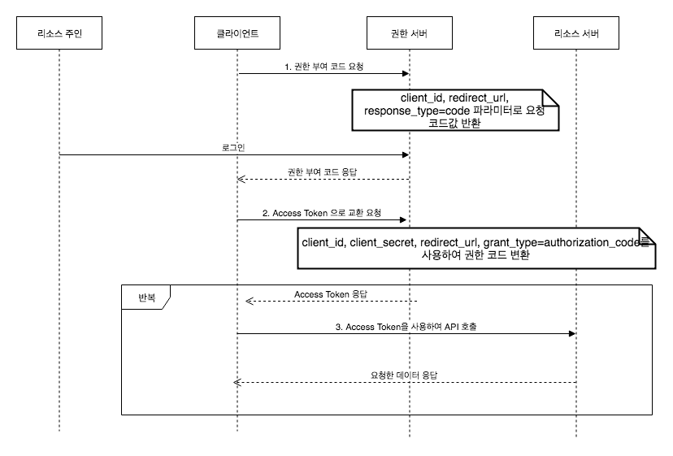
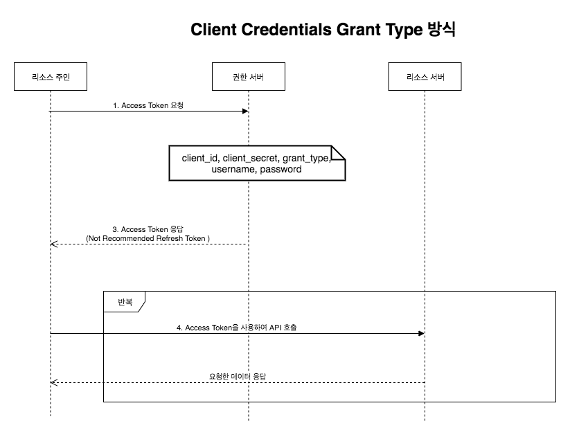

# 기술면접 질문 복기

### 가상 메모리란?

가상 메모리(가상 기억 장치)는 메모리 관리 기법의 하나로 기계에 실제 이용 가능한 메모리 자원을 이상적으로 추상화하여 사용자들에게 큰 메모리로 보이게 만드는 것을 의미한다. 주로 멀티태스킹 운영 체제에서 흔히 사용되며, 실제 주기억장치보다 큰 메모리 영역을 제공하는 방법으로도 사용된다.

가상적으로 주어진 주소를 가상 주소(virtual address) 또는 논리 주소(logical address)라고 하며, 실제 메모리 상에서 유효한 주소를 물리 주소(physical address) 또는 실 주소(real address)라고 한다.

가상 주소 공간은 메모리 관리 장치(MMU)에 의해서 물리 주소로 변환된다. 가상 메모리는 관리 방식에 따라 세그먼트 방식과 페이징 방식으로 구분한다.

### 32bit 컴퓨터가 프로세스에 할당할 수 있는 최대 메모리의 양은?

4GB(2^32bits)이다. 같은 논리로 64bit 컴퓨터는 16EB(2^64bits)를 할당할 수 있다.

### OAuth의 인증방식 4가지

- **Authorization Code Grant Type**

  

  1. 클라이언트는 리소스 주인이 권한 서버에게 Client ID, Redirect URI, Response_type을 code로 지정하여 전달하도록 유도. 인증이 된다면 `code` 값을 돌려 받음
  2. 클라이언트는 전달 받은 `code`을 사용해 필요한 정보들과 함께 `access token` 획득 요청을 권한 서버에게 보냄
  3. 획득한 `access token`을 사용해 리소스 서버에 사용자의 데이터를 요청

- **Implicit Grant Type**

  

  1. 클라이언트는 리소스 주인이 권한 서버에게 Client ID, Redirect URI, Response_type을 code로 지정하여 전달하도록 유도. 인증이 되면 `token`을 돌려 받음
  2. 획득한 `access token`이 유요한지 검증
  3. 검증에 대한 응답을 돌려 받음
  4. 획득한 `access token`을 사용해 리소스 서버에 사용자의 데이터를 요청

- **Resource Owner Password Credentials Grant Type**

  

  1. 리소스 주인이 인증을 진행. 대부분 ID/PW로 `자격증명`을 수행
  2. 클라이언트는 전달 받은 정보를 기반으로 권한 서버에 `access token` 획득 요청
  3. `access token`을 돌려 받음
  4. 획득한 `access token`을 사용해 리소스 서버에 사용자의 데이터를 요청

- **Client Credentials Grant Type**

  
  1. 리소스 주인이 `access token` 정보를 직접 권한 서버에 요청
  2. `access token`을 돌려 받음
  3. 획득한 `access token`을 사용해 리소스 서버에 사용자의 데이터를 요청

### URL 리다이렉션은 어떻게 일어나는가?

HTTP에서 리다이렉션은 요청에 대해 특별한 응답(리다이렉션)을 전송함으로써 이루어진다. HTTP 리다이렉트는 `3xx` 상태 코드를 지닌 응답이다. 리다이렉션 응답을 수신한 브라우저는 응답에 제공된 새로운 URL로 요청을 보내게 된다. 리다이렉션 요청의 대부분은 사용자에게 보이지 않으며, 적은 성능 저하를 일으킨다.

리다이렉트에는 몇 가지 유형이 있는데, 영속적, 일시적 그리고 특수 리다이렉션과 같이 세 가지로 분류된다.

### JSON Web Token은 무엇인가? JWT는 인터넷에서 바로 해독이 가능한데 왜 보안적으로 안전하다고 생각하나?

JSON Web Token(JWT)은 토큰 기반 인증 방식으로 사용자의 세션 상태를 저장하는 것이 아니라 필요한 정보를 토큰 body에 저장해 사용자가 가지게 하고 이를 증명서처럼 사용하는 방식이다.

토큰을 만들기 위해서는 Header, Payload, Signature가 필요하다.

- Header : 정보를 암호화할 해시 알고리즘(alg), 타입(type) 등을 포함
- Payload : 서버에 보낼 데이터를 포함. 클라이언트에 대한 정보, Meta data 등이 들어가있고, Base64로 인코딩 되어있음
- Signature : Base64 방식으로 인코딩한 Header, Payload 그리고 SECRET KEY를 더한 후 서명

JWT의 최종 방식은 `Encoded Header.Encoded Payload.Signature(xxxx.yyyy.zzzz)`다.

Header와 Payload는 Base64로 인코딩만 되므로 누구든 디코딩하여 확인할 수 있다. 따라서, JWT에는 중요한 정보를 포함해서는 안된다. 하지만, Signature는 SECRET KEY를 알지 못하면 복호화할 수 없다.

JWT의 인증 방식은 다음과 같다.

1. 클라이언트가 로그인 정보를 서버에 전달
2. 서버에서 전달된 데이터로 사용자를 확인하고, 사용자의 고유한 ID값을 부여한 후, 기타 필요한 정보를 Payload에 추가
3. JWT 유효기간을 설정
4. 암호화할 SECRET KEY를 이용해 Access Token을 발급
5. 사용자는 Access Token을 받아 저장한 후, 인증이 필요한 요청마다 토큰을 헤더에 추가하여 전달
6. 서버에서는 JWT의 Signature를 SECRET KEY로 복호화한 후, JWT 조작 여부 및 유효기간을 확인
7. JWT가 유효하면 Payload를 디코딩하여 사용자의 ID에 맞는 데이터를 호출

세션/쿠키 방식은 세션 저장소에 유저의 정보를 저장하는 반면, JWT는 토큰 안에 유저의 정보를 저장한다. 클라이언트 입장에서는 쿠키에 세션 ID를 보내든, 토큰을 보내든 비슷하지만, 서버 입장에서는 인증을 위해 암호화를 하냐, 별도의 저장소를 이용하냐에 따른 차이가 발생한다.

**장점**

- JWT는 발급한 토큰에 대한 검증 과정만 거치기 때문에 별도의 저장소(ex. 세션)가 필요 없다.
- 서버 확장, 유지, 보수에 유리
- 토큰 기반으로 다른 인증 시스템에 접근이 가능

**단점**

- 세션/쿠키는 세션 ID가 조작되었으면 해당 세션을 삭제하면 되지만, JWT는 한 번 발급되면 유효기간이 만료될 때까지 계속 사용이 가능하므로 JWT를 탈취당하면 JWT의 정보를 뺏길 수 있다.
- 위의 문제로 인해 유효기간을 짧게하면 인증을 자주 해줘야하고, 길게하면 정보를 탈취당할 위험이 있다.
- Payload 정보가 제한적 Payload는 따로 암호화되지 않으므로 누구나 디코딩하여 정보를 확인할 수 있다.
- 세션/쿠키 방식에 비해 Payload에 담는 정보가 많아지면 JWT의 길이도 길어져 자주 사용하면 서버의 자원을 많이 낭비한다.