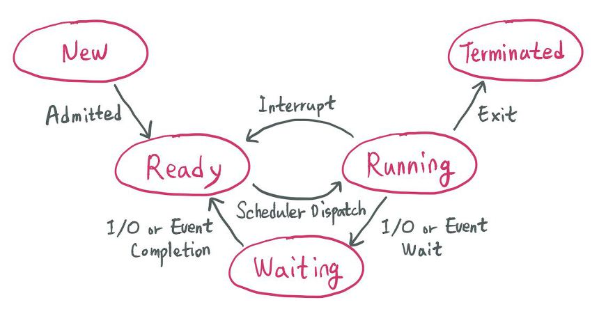

# Operation System

### Process & Thread

- Process : 프로그램이 실행될 때, CPU로부터 자원을 할당 받아 메모리 상에서 실행중인 작업
  - 특징
    - CPU로부터 자신만의 고유 공간과 자원을 할당받아 사용
    - 다른 프로세스와 자원을 공유하지 않음
  - 구성
    - Code : 프로그램 소스 코드
    - Data : 전역 변수, 정적 변수, 배열 등
    - Heap : 메모리 동적 할당에 사용
- Thread : 프로세스 내에서 실행되는 작업의 단위
  - 특징
    - 같은 프로세스 위에 존재하는 다른 스레드들과 프로세스 자원을 공유
  - 구성
    - Stack : 지역 변수, 함수 등

### Multi-Process & Multi-Thread

- Multi-process : CPU위의 코어의 개수 만큼 동시에 여러 개의 프로세스를 진행
  - 안정성 보장(프로세스 간에 자원을 공유 하지 않으므로 공유 자원 문제 X)
  - 각각이 독립된 자원 영역을 할당 받으므로 메모리 사용량이 멀티쓰레드이 비해 많음
  - 해당 문제를 해결하기 위한 방법으로 세마포어(Semaphore)가 있음
- Multi-Thread : 프로세스 위에서 여러 개의 쓰레드를 만들어 진행
  - 같은 프로세스 위에 존재하는 쓰레드들 간에 자원 공유가 가능하여 멀티 프로세스에 비해 사용하는 메모리의 양이 적음
  - 자원을 공유하므로 공유 자원 문제(데드락(DeadLock), 경쟁 상태(Race Condition))가 발생할 수 있음
  - 해당 문제를 해결하기 위한 방법으로 뮤텍스(Mutex)가 있음

### Semaphore & Mutex

- Semaphore
  - 정의
    - 멀티 프로세스 작업에서 공유자원(커널의 공유메모리)에 대한 접근을 제한하는 방법
  - 세마포어 P,V 연산
    - P : 임계 구역에 들어가기 전에 수행
    - V : 임계 구역에 나올 때 수행
- Mutex(Mutual Exclusion)
  - 정의
    - 멀티 스레드 작업에서 공유자원에 대한 접근을 제한하는 방법
  - Mutex Lock
    - Lock : 스레드가 임계구역에 들어갈 때, 공유자원에 대한 다른 스레드들의 접근을 제한
    - Unlock : 스레드가 임계구역에서의 작업을 끝마치고, 공유자원에 대한 다른 스레드들의 접근을 허용
  - 뮤텍스는 상태가 두개뿐이므로 **이진 세마포어**라고도 한다.

### Context Switching

- 정의
  - 진행중이던 작업이 인터럽트에 의해 정지되었을 때, 진행중인 작업의 상태를 저장하고, CPU 레지스터에 진행할 작업의 데이터를 적재하는 과정

### Interrupt

- 정의
  - 프로그램을 실행하는 도중에 예기치 못한 상황이 발생했을 때, 진행중이던 작업을 중지 및 상태를 저장하고 발생한 상황을 먼저 처리한 뒤에 진행중이었던 작업을 이어서 진행하는 것
  - 외부/내부 인터럽트, 소프트웨어 인터럽트
    - 외부 인터럽트 : 하드웨어로부터 신호, 외부 입출력
    - 내부 인터럽트 : 에러 발생, 비정상적인 코드
    - 소프트웨어 인터럽트 : 사용자 코드에 의한 인터럽트
- 처리 방식
  - 폴링
    - 사용자가 정기적으로 명령어를 사용하여 우선순위 변화를 읽음
    - 인터럽트 요청 시에 우선순위를 비교하여 가장 높은 인터럽트를 찾아 먼저 수행(하드웨어 자원을 사용하지 않고, 속도가 느림)
  - 인터럽트
    - MCU(Micro-Controller Unit) 자체가 하드웨어적으로 변화를 체크하여 변화 감지 시에 동작
    - 하드웨어 자원을 사용하지만 폴링 방식에 비해 속도가 빠르고 유연하게 실시간으로 대처 가능

### System call

- 정의
  - 프로세스 생성 및 제어를 위한 명령어들
  - Java에서는 fork(), exec(), wait() 등

### PCB(Process Control Block)

- 정의
  - 프로세스가 생성될 때 프로세스의 정보인 프로세스 메타데이터를 저장하는 장소
- Process Metadata
  - Process ID
  - Process State
  - Process Priority
  - CPU Register
  - Owner
  - CPU Usage
  - Memory Usage
- 역할
  - CPU에서 인터럽트가 일어났을 시에 진행 중이던 프로세스를 대기 상태로 바꾸면서 진행한 작업 내역을 PCB에 저장하고, 추후에 인터럽트가 해결되고 다시 진행할 때 PCB를 참고하여 중지한 시점부터 작업을 진행
  - PCB는 프로세스가 생성될 때 함께 만들어지고, 프로세스가 소멸할 때 함께 삭제된다.
  - PCB를 참고하여 CPU 레지스터에 적재되는 정보가 바뀌는 것이 `Context Switching`이다.

### IPC(Inter-Process Communication)

- 정의
  - 커널에서 제공하는 기능으로 프로세스 간의 통신을 가능하게 해줌

### CPU Scheduling

- 정의
  - CPU를 효율적으로 사용하기 위해 프로세스의 작동 순서를 배정하는 것
  - OS가 작동 순서를 자율적으로 배정할 수 있느냐에 따라 선점/비선점 스케줄링으로 구분됨
- 선점 스케줄링
  - OS가 CPU의 사용권을 선점하거나 회수할 수 있는 경우
- 비선점 스케줄링
  - 입출력(I/O) 및 이벤트 발생 시, 해당 작업이 완료될 때까지 실행을 보장하는 경우

### Process LifeCycle

- **승인 (Admitted)** : 프로세스 생성이 가능하여 승인됨.

-  **스케줄러 디스패치 (Scheduler Dispatch)** : 준비 상태에 있는 프로세스 중 하나를 선택하여 실행시키는 것.

-  **인터럽트 (Interrupt)** : 예외, 입출력, 이벤트 등이 발생하여 현재 실행 중인 프로세스를 준비 상태로 바꾸고, 해당 작업을 먼저 처리하는 것.

-  **입출력 또는 이벤트 대기 (I/O or Event wait)** : 실행 중인 프로세스가 입출력이나 이벤트를 처리해야 하는 경우, 입출력/이벤트가 모두 끝날 때까지 대기 상태로 만드는 것.

- **입출력 또는 이벤트 완료 (I/O or Event Completion)** : 입출력/이벤트가 끝난 프로세스를 준비 상태로 전환하여 스케줄러에 의해 선택될 수 있도록 만드는 것.

### DeadLock

- 정의

  - 두 프로세스가 중복된 자원을 필요로할 때, 각각의 자원을 점유하고 있어 두 프로세스 모두 무한정으로 대기상태로 있는 경우를 교착 상태(DeadLock)이라 한다.
  - 멀티 프로그래밍 환경에서 한정된 자원을 얻기 위해 서로 경쟁하는 상황(Race Condition)

- 데드락 발생 4가지 조건

  - 상호 배제(Mutual exclusion)

    자원은 한번에 한 프로세스만 사용할 수 있음

  - 점유 대기(Hold and Wait)

    최소한 하나의 자원을 점유하고 있으면서 다른 프로세스에 할당되어 사용하고 있는 자원을 추가로 점유하기 위해 대기하는 프로세스가 존재해야 함

  - 비선점(No Preemption)

    다른 프로세스에 할당된 자원은 사용이 끝날 때까지 강제로 빼앗을 수 없음

  - 순환대기(Circular wait)

    프로세스의 집합에서 순환 형태로 자원을 대기하고 있어야 함

- 데드락 해결 방법

  - 예방 & 회피(데드락 발생 X)
    - 예방 : 데드락 발생 4가지 조건 중 하나를 부정(자원을 많이 소모)
    - 회피 : 은행원 알고리즘 - 프로세스에 자원을 할당하기 전에 할당 후에 데드락 상태가 발생하는지 테스트
  - 탐지 & 회복(데드락 발생 O)
    - 탐지 : 자원 할당 그래프를 통해 데드락 상태 탐지(탐지 알고리즘)
    - 회복 : 프로세스를 종료하거나 프로세스에 할당된 자원을 해제하여 데드락 상태 회복