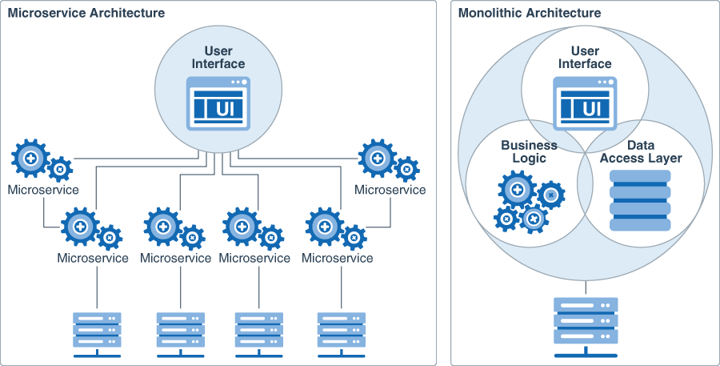
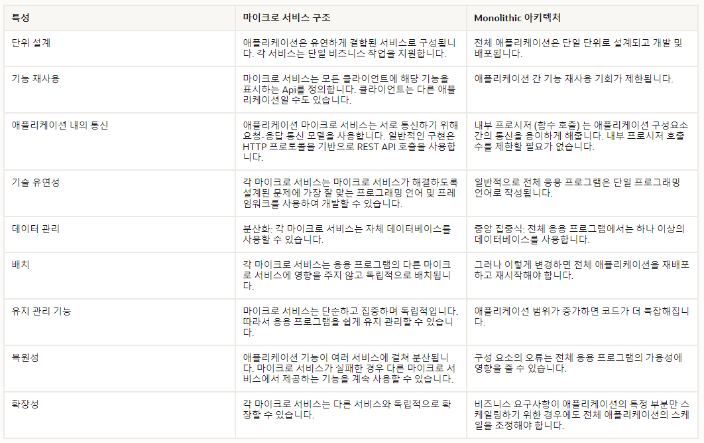

# 소프트웨어 공학

## 모듈화(Modularity)

- 정의
  - 소프트웨어를 각 기능별로 분할, 설계 및 구현
- 특징
  - 소프트웨어의 복잡도 감소,성능 향상
  - 효과적인 유지보수
  - 모듈의 독립성

### 결합도(Coupling)

- 정의
  - 어떤 모듈이 다른 모듈에 의존하는 정도를 측정하는 척도
  - 결합도가 낮을수록 독립적인 모듈

### 응집도(Cohesion)

- 정의
  - 하나의 모듈이 하나의 기능을 수행하는 요소들간의 연관성 척도
  - 응집도가 높을수록 독립적인 모듈

#### 이상적인 소프트웨어는 낮은 결합도와 높은 응집도를 가져야한다.

### 동시성(Concurrency)과 병렬성(Parallelism)

|                        **동시성**                         |                 **병렬성**                  |
| :-------------------------------------------------------: | :-----------------------------------------: |
| 동시에 실행되는 것처럼 보이지만 하나의 작업만 처리되는 것 |    실제로 동시에 여러 작업이 처리되는 것    |
|        싱글 코어에서 멀티 쓰레드를 동작시키는 방식        | 멀티 코어에서 멀티 쓰레드를 동작시키는 방식 |
|                     Context Switching                     |            Non-Context Switching            |
|                       논리적인 개념                       |                물리적인 개념                |

## 웹 분산 시스템

- 고려사항

  - 가용성(Availability) : 웹 분산 시스템은 고가용성(High Availability)를 가져야 한다. 컴포넌트의 이중화와 서버 장애가 발생했을 때를 대비한 빠른 복구 방법, 문제가 발생해도 기능을 위한 최소한의 동작이 가능하도록 시스템을 설계해야한다.
  - 성능(Performance) : 속도, 사용성, 만족도. 빠른 응답과 낮은 레이턴시를 위한 최적화된 시스템이 필요하다.
  - 신뢰성(Reliability) : 항상 똑같은 요청에 똑같은 응답을 제공해야한다.
  - 확장성(Scalability) : 대규모 분산 시스템에서 단순한 확장뿐만 아니라 더 많은 부하를 처리할 수 있도록 처리량을 증가시키 위한 노력이 필요하다.
  - 관리성(Manageability) : 쉽게 운용할 수 있는 시스템을 설계하는 것.
  - 비용(Cost) : 하드웨어, 소프트웨어, 배포, 관리 비용 등

  

### 대규모 웹 애플리케이션

- 서비스
  - 확장성 있는 시스템을 설계할 때 각각의 명확한 인터페이스를 기반으로 기능별로 나누어 생각하는 것은 좋은 방법(SOA, Service-Oriented Architecture)
  - 시스템을 상호 보완적인 서비스로 분할한다는 것은 시스템을 기능 단위로 분리시키는 것을 의미한다.
- 이중화(Redundancy)
  - 장애에 대처하기 위한 웹 아키텍처에는 데이터와 서버에 대한 이중화가 고려되어야 한다.
  - 시스템을 이중화하는 것은 단일 고장점(single point of failure)을 없애고, 장애 발생 시에도 백업하게 할 수 있거나 시스템이 계속 동작할 수 있게 한다.
  - 서비스를 이중화할 때 중요한 것은 Shared Nothing Architecture를 만드는 것이다.
- 파티선(Partitions)
  - 하나의 서버에 감당할 수 없는 많은 데이터가 있거나 연산을 위해 많은 컴퓨팅 자원이 필요하게 되어 성능이 떨어지게 되는 경우에 대한 해법
  - 수직적 확장과 수평적 확장
    - 수직적 확장(Scale up) : 개개의 서버에 더 많은 자원을 추가하여 서버의 성능을 높이는 것
    - 수평적 확장(Scale out) : 서버 및 노드를 추가하는 것.

### MSA(Micro-Service Architecture)

- 정의
  - 전체 애플리케이션을 특정 목적을 가진 애플리케이션 단위로 나누는 것 (약한 결합도, 강한 응집도)
  - 나누어진 애플리케이션들은 독립된 서비스를 제공하더라도 문제가 없어야함.
  - 등장배경 - Monolithic Architecture의 한계
    - 부분 장애가 전체 서비스의 장애로 확대될 수 있음
    - 규모가 커지면 부분적인 scale-out이 어려워짐
    - 서비스의 변경과 수정시 발생 가능한 장애의 영향력 파악이 어려워짐
    - 배포 시간이 오래걸림
    - Framework와 Programming Language에 종속적
  - 특징
    - MSA는 API(REST, RPC)를 통해서만 상호작용
      - 마이크로 서비스는 서비스의 end-point을 API 형태로 외부에 노출하고, 실질적인 세부 사항은 모두 추상화
    - 개별의 서비스 개발 가능 및 유지 보수에 용이
    - 프레임워크와 언어에 종속적이지 않음
    - 서비스 부하에 따라 부분적인 scale-out이 가능
  - 문제점
    - 각각의 애플리케이션에 대한 트랜잭션 및 에러 처리가 필요
    - 애플리케이션의 수가 많아지고 복잡해지면 테스트가 어려워짐
    - Monolithic에 비해 네트워크 레이턴시와 트래픽이 증가
    - 각각의 애플리케이션의 데이터 무결성을 책임지지 못함

### CI/CD

- 정의
  - CI(Continuous-Integration) : Build, Test, Merge를 실시하는 통합 프로세스
  - CD(Continuous-Deployment) : 애플리케이션 변경 사항이 테스트를 거쳐 자동으로 배포 되는 프로세스